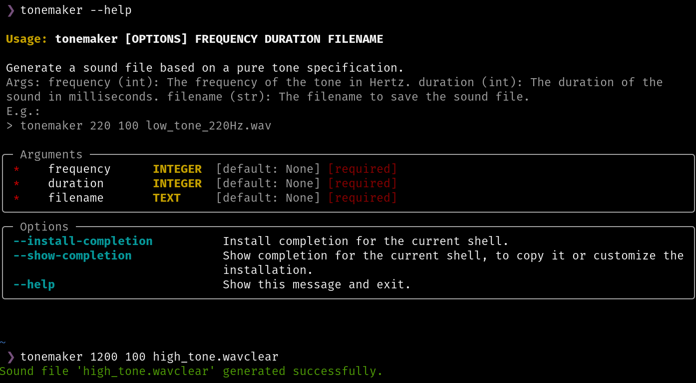

# ToneMaker

Travis L. Seymour, PhD

### A simple commandline tool to generate a sound files based on a pure tone specifications.

#### Args:

- frequency (int): The frequency of the tone in Hertz.
- duration (int): The duration of the sound in milliseconds.
- filename (str): The filename to save the sound file.

Note: The generated tone will be 16-bit with a 44100 sample rate.

---



---

## Installation Overview

To install ToneMaker, I suggest you use `uv` (https://docs.astral.sh/uv/) on MacOS, Windows, and Linux. Although you can use a very similar set of commands to install ToneMaker with `PipX` (https://pipx.pypa.io/latest/), I will describe how to do so using `uv` below.

## Install `uv`

You should install `uv` using the instructions at https://docs.astral.sh/uv/getting-started/installation/. However, the commands are simple and have been reproduced here for the most common use cases (though many other approaches are described for each platform on the `uv` installation webpage):

### MacOS & Linux

Use curl to download the script and execute it with sh:

```bash
curl -LsSf https://astral.sh/uv/install.sh | sh
```

If your system doesn't have curl, you can use wget:

```bash
wget -qO- https://astral.sh/uv/install.sh | sh
```

### Windows

Use irm to download the script and execute it with iex:

```bash
powershell -ExecutionPolicy ByPass -c "irm https://astral.sh/uv/install.ps1 | iex"
```

## Install ToneMaker

```bash
uv tool install git+https://github.com/travisseymour/ToneMaker.git
```

Hopefully, that worked without a problem! Otherwise, see below for ways to troubleshoot the most common issues:

🚩 If `uv` tool install complains about the `git` tool being missing, then you must [**install git**](https://git-scm.com/downloads) and then retry the command above.

🚩 If `uv` tool install complains that no appropriate version of Python is installed on your system, then you can install such a version using this command:

`uv python install [VERSION]`

e.g.:

```bash
uv python install 3.10
```

🚩 If `uv` still says it cannot find Python, then find a version yourself like this:

```bash
uv python list
```

You should see all the installed python versions and their respective file paths. Copy one of the paths that match the target Python version and re-run the EPICcoder installation using this form `uv tool install git+https://github.com/travisseymour/EPICcoder.git --ptyhon [THE COPIED PYTHON PATH]`.

For example:

- It might look like this on Linux:
  - ```bash
    uv tool install git+https://github.com/travisseymour/ToneMaker.git --python .local/share/uv/python/cpython-3.10.14-linux-x86_64-gnu/bin/python3
    ```
- It might look like this on MacOS:
  - ```bash
    uv tool install git+https://github.com/travisseymour/ToneMaker.git --python .local/share/uv/python/cpython-3.12.7-macos-x86_64-none/bin/python3
    ```
- It might look like this on Windows:
  - ```bash
    uv tool install git+https://github.com/travisseymour/ToneMaker.git --python AppData\Roaming\uv\python\cpython-3.11.9-windows-x86_64-none\python.exe
    ```

--- 

## Using ToneMaker

To create a wavefile called "low_tone_220Hz.wav" that plays a 220 hertz tone for 100 milliseconds, enter a command like this:

```bash
tonemaker 220 100 low_tone_220Hz.wav
```

---

## Upgrade ToneMaker

Upgrade ToneMaker by opening your operating system's terminal application and type this command:

```bash
uv tool upgrade tonemaker
```

## Uninstall ToneMaker

Uninstall ToneMaker by opening your operating system's terminal application and type this command:

```bash
uv tool uninstall tonemaker
```
